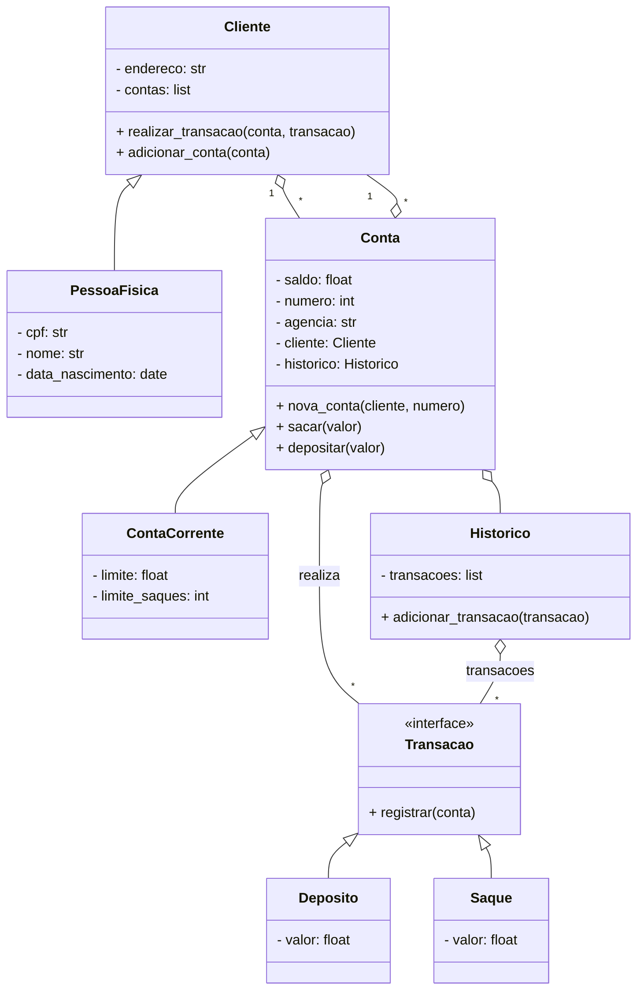

# Desafio - Modelando o Sistema Bancário em POO com Python

Este projeto é uma implementação de um sistema bancário orientado a objetos em Python, baseada em um diagrama UML fornecido. O objetivo é exercitar conceitos de POO como herança, composição, encapsulamento e polimorfismo, simulando operações bancárias básicas.

## Diagrama do Sistema (em Mermaid)



> **Nota:** Para visualizar este diagrama, utilize um visualizador de diagramas Mermaid, como o plugin do VSCode ou o site [Mermaid Live Editor](https://mermaid.live/).

## Estrutura do Sistema

O sistema é composto pelas seguintes classes principais:

- **Cliente**: Representa um cliente do banco, podendo ser uma pessoa física. Possui endereço e uma lista de contas.
- **PessoaFisica**: Subclasse de Cliente, adiciona atributos como CPF, nome e data de nascimento.
- **Conta**: Classe base para contas bancárias, com saldo, número, agência, cliente e histórico de transações.
- **ContaCorrente**: Subclasse de Conta, adiciona limite de crédito e limite de saques.
- **Historico**: Registra todas as transações realizadas em uma conta.
- **Transacao**: Interface para operações bancárias, com método abstrato `registrar`.
- **Deposito** e **Saque**: Subclasses de Transacao, implementam as operações de depósito e saque.

## Funcionalidades

- Criação de clientes e contas correntes.
- Realização de depósitos e saques, respeitando limites definidos.
- Registro automático de todas as transações no histórico da conta.
- Encapsulamento das regras de negócio em métodos e subclasses.

## Exemplo de Uso

O arquivo `main.py` demonstra um fluxo básico de uso:

```python
from pessoa_fisica import PessoaFisica
from conta_corrente import ContaCorrente
from operacoes import Deposito, Saque
from datetime import date

if __name__ == "__main__":
    cliente = PessoaFisica("123.456.789-00", "João Silva", date(1990, 5, 20), "Rua das Flores, 123")
    conta = ContaCorrente(cliente, 1, limite=500, limite_saques=3)
    cliente.adicionar_conta(conta)

    print(f"Saldo inicial: {conta.saldo}")
    cliente.realizar_transacao(conta, Deposito(200))
    print(f"Saldo após depósito: {conta.saldo}")
    cliente.realizar_transacao(conta, Saque(100))
    print(f"Saldo após saque: {conta.saldo}")
    print(f"Transações registradas: {len(conta.historico.transacoes)}")
```

## Como Executar

1. Certifique-se de ter o Python 3 instalado.
2. Clone este repositório e acesse a pasta do projeto.
3. Execute o arquivo `main.py`:
   ```bash
   python main.py
   ```

## Licença

Este projeto é apenas para fins educacionais.
